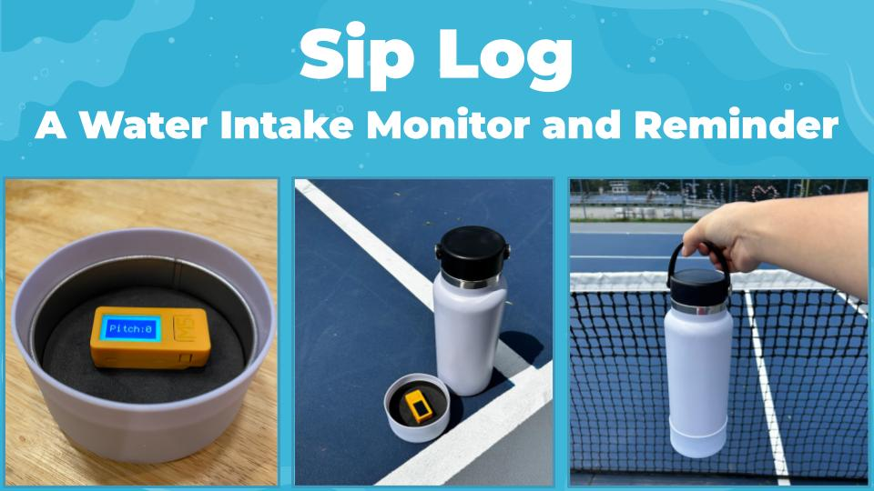

  

Sip Log is a mobile device that computerizes a water bottle to monitor water intake during physical activity. Attached to the bottom of a bottle, it keeps track of how many times an athlete drank their water, estimates how much water they drank in total, records intake log in the cloud, and alerts insufficient intake via smartphone notification. It aims to aid athletes be more aware of their water intake, along with preventing dehydration from affecting their performance. Sip Log uses a battery-operated ESP32 microcontroller that runs CircuitPython code to detect water intake by sensing the tilt of a bottle with a 3-axis accelerometer. 

This project was presented at [PhysTech 2025](https://phystech2025.devpost.com/). 

